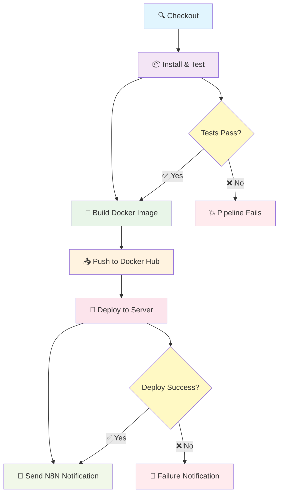
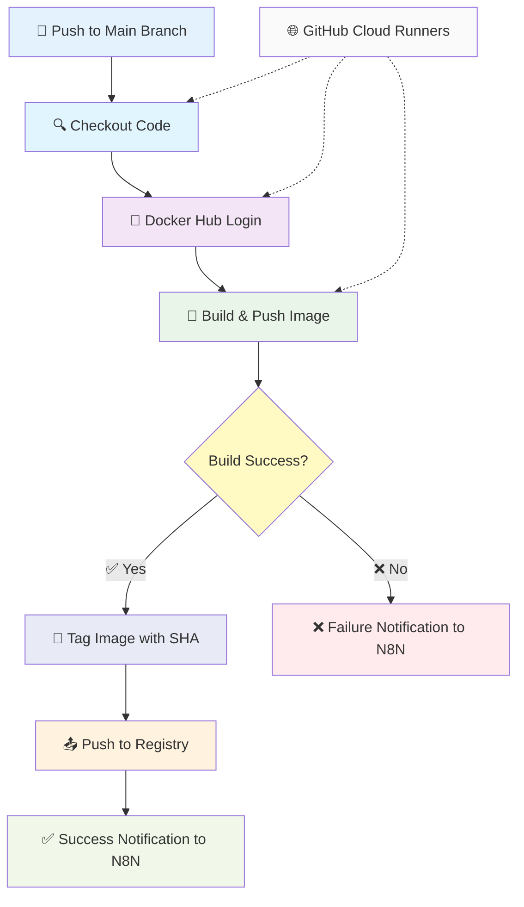
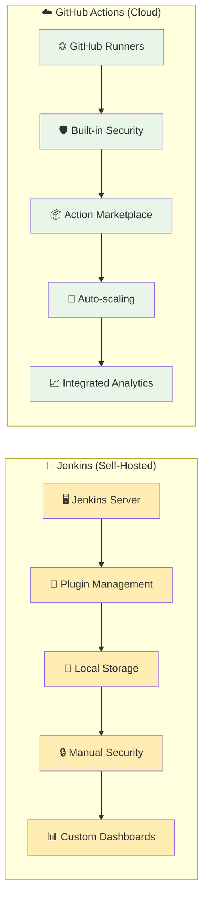
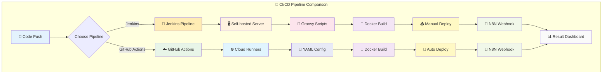

# Express Docker Application


โปรเจ็กต์ Express.js + TypeScript REST API ที่ทำงานใน Docker Container พร้อมด้วย CI/CD Pipeline ผ่าน Jenkins, Github Actions และการแจ้งเตือนผ่าน N8N

## 📋 Table of Contents

- [Express Docker Application](#express-docker-application)
  - [📋 Table of Contents](#-table-of-contents)
  - [🚀 Features](#-features)
  - [🏗️ Project Structure](#️-project-structure)
  - [🛠️ Prerequisites](#️-prerequisites)
  - [⚡ Quick Start](#-quick-start)
    - [1. Clone Repository](#1-clone-repository)
    - [2. Local Development](#2-local-development)
    - [3. Docker Development](#3-docker-development)
  - [🐳 Docker Commands](#-docker-commands)
  - [🧪 Testing](#-testing)
  - [🔄 CI/CD Pipeline](#-cicd-pipeline)
  - [⚡ GitHub Actions](#-github-actions)
  - [📡 API Endpoints](#-api-endpoints)
  - [🔧 Configuration](#-configuration)
  - [📝 Environment Variables](#-environment-variables)
  - [📊 Test Coverage](#-test-coverage)
  - [🤝 Contributing](#-contributing)
  - [📄 License](#-license)

## 🚀 Features

- ✅ **Express.js REST API** - Fast, minimal Node.js web framework
- 🔷 **TypeScript Support** - Type-safe JavaScript development
- 🐳 **Docker Containerization** - Lightweight Alpine-based container
- 🧪 **Jest Testing** - Comprehensive test suite with Supertest
- 🔄 **CI/CD Pipeline** - Automated Jenkins pipeline with deployment
- ⚡ **GitHub Actions** - Modern CI/CD with GitHub-native automation
- 📊 **Test Coverage** - Code coverage reports and analysis
- 📦 **Docker Hub Integration** - Automated image publishing
- 🔔 **Server Deployment** - Automated deployment to remote servers
- 🏷️ **Semantic Versioning** - Build number based tagging
- ⚡ **Hot Reload** - Development with ts-node

## 🏗️ Project Structure

```
express-docker-app/
├── 📁 src/
│   └── 📄 app.ts                   # Main Express application (TypeScript)
├── 📁 tests/
│   └── 📄 app.test.ts              # Jest test suite with Supertest
├── 📁 dist/                       # Compiled JavaScript output
│   └── 📄 app.js                  # Compiled application
├── 📁 node_modules/               # Node.js dependencies
├── � .github/
│   └── 📁 workflows/
│       └── 📄 main.yml               # GitHub Actions workflow
├── �🐳 Dockerfile                  # Docker build configuration
├── 🔧 Jenkinsfile                 # Jenkins CI/CD pipeline
├── ⚙️ jest.config.js              # Jest testing configuration
├── 📄 package.json                # Node.js project configuration
├── 📄 package-lock.json           # Dependency lock file
├── 📄 tsconfig.json               # TypeScript configuration
└── 📖 README.md                   # Project documentation
```

## 🛠️ Prerequisites

- **Node.js 22+** (LTS recommended)
- **npm 10+** or **yarn**
- **TypeScript** (installed globally or via npx)
- **Docker & Docker Compose**
- **Git**
- **Jenkins** (for CI/CD)
- **SSH Access** (for deployment)

## ⚡ Quick Start

### 1. Clone Repository

```bash
git clone <repository-url>
cd express-docker-app
```

### 2. Local Development

```bash
# Install dependencies
npm install

# Run in development mode (TypeScript)
npm run start:ts

# Or build and run JavaScript
npm run build
npm start

# Access the API
curl http://localhost:3000/api/hello
```

### 3. Docker Development

```bash
# Build Docker image
docker build -t express-docker-app .

# Run container
docker run -p 3000:3000 express-docker-app

# Access the API
curl http://localhost:3000/api/hello
```

## 🐳 Docker Commands

```bash
# Build image with tag
docker build -t your-dockerhub-username/express-docker-app:latest .

# Run container in background
docker run -d -p 3000:3000 --name express-app express-docker-app

# View logs
docker logs express-app

# Follow logs
docker logs -f express-app

# Stop container
docker stop express-app

# Remove container
docker rm express-app

# Push to Docker Hub
docker push your-dockerhub-username/express-docker-app:latest
```

## 🧪 Testing

```bash
# Install dependencies
npm install

# Run all tests
npm test

# Run tests with coverage
npm test -- --coverage

# Run tests in watch mode
npm test -- --watch

# Run specific test file
npm test -- app.test.ts

# Run tests with verbose output
npm test -- --verbose
```

### Test Structure

- **Unit Tests**: `tests/app.test.ts` - API endpoint testing with Supertest
- **Configuration**: `jest.config.js` - Jest testing framework setup
- **TypeScript Support**: Tests written in TypeScript with ts-jest

### Test Example

```typescript
import request from 'supertest'
import express from 'express'

const app = express()
app.get('/api/hello', (_, res) => res.json({ message: 'Hello from Express API!' }))

test('GET /api/hello', async () => {
  const res = await request(app).get('/api/hello')
  expect(res.statusCode).toBe(200)
  expect(res.body.message).toBe('Hello from Express API!')
})
```

## 🔄 CI/CD Pipeline

### Jenkins Pipeline Architecture



Jenkins Pipeline stages:

1. **🔍 Checkout** - Pull latest code from Git repository
2. **📦 Install & Test** - Install dependencies and run test suite
3. **🐳 Build Docker Image** - Create optimized container image
4. **📤 Push to Docker Hub** - Upload to container registry
5. **🚀 Deploy to Server** - Automated deployment via SSH

### Pipeline Features

- ✅ Node.js dependency management
- 🧪 Automated testing with Jest
- 📊 Test result reporting
- 🐳 Docker image building and tagging
- 🔔 Deployment notifications
- 🚀 Remote server deployment

## ⚡ GitHub Actions

### GitHub Actions Workflow Architecture



GitHub Actions Workflow สำหรับ CI/CD automation ที่ทำงานแบบ cloud-native:

### Workflow Stages

1. **🔍 Checkout** - Pull latest code from repository
2. **🔑 Docker Hub Login** - Authenticate with container registry
3. **🐳 Build & Push** - Create and upload Docker image with tags
4. **✅ Success Notification** - Send N8N webhook on successful deployment
5. **❌ Failure Notification** - Send N8N webhook on pipeline failure

### Workflow Features

- ✅ **Trigger on Push** - Automatically runs on main branch commits
- 🐳 **Multi-tag Docker Images** - Creates `latest` and commit SHA tags
- 🔔 **N8N Integration** - Webhook notifications for success/failure
- 🔒 **Secure Secrets** - Uses GitHub Secrets for credentials
- ⚡ **Fast Execution** - Cloud-native runners for quick builds

### GitHub Secrets Configuration

โปรเจ็กต์ใช้ GitHub Secrets สำหรับการจัดการข้อมูลลับ:

| Secret Name | Description | Required |
|-------------|-------------|-----------|
| `DOCKERHUB_USERNAME` | Docker Hub username | ✅ |
| `DOCKERHUB_TOKEN` | Docker Hub access token | ✅ |
| `N8N_WEBHOOK_URL` | N8N webhook endpoint URL | ✅ |

### Setting Up GitHub Secrets

```bash
# Navigate to your GitHub repository
# Go to Settings > Secrets and variables > Actions
# Add the following secrets:

1. DOCKERHUB_USERNAME: your-docker-username
2. DOCKERHUB_TOKEN: your-docker-access-token
3. N8N_WEBHOOK_URL: https://your-n8n-instance.com/webhook/github-actions
```

### Workflow File Structure

```yaml
# .github/workflows/main.yml
name: CI/CD - Express Docker App

on:
  push:
    branches: [ "main" ]

jobs:
  build-and-push:
    runs-on: ubuntu-latest
    steps:
      - name: Checkout repository
        uses: actions/checkout@v4
      
      - name: Log in to Docker Hub
        uses: docker/login-action@v3
        with:
          username: ${{ secrets.DOCKERHUB_USERNAME }}
          password: ${{ secrets.DOCKERHUB_TOKEN }}
      
      - name: Build and push Docker image
        uses: docker/build-push-action@v5
        with:
          context: .
          push: true
          tags: |
            ${{ secrets.DOCKERHUB_USERNAME }}/my-express-api:latest
            ${{ secrets.DOCKERHUB_USERNAME }}/my-express-api:${{ github.sha }}
```

### Webhook Payload Format

GitHub Actions ส่งข้อมูลไปยัง N8N ในรูปแบบ JSON:

**Success Notification:**
```json
{
  "status": "SUCCESS",
  "project": "username/express-docker-app",
  "commit": "abc123def456",
  "imageUrl": "username/my-express-api:latest",
  "workflowRunUrl": "https://github.com/username/repo/actions/runs/123456"
}
```

**Failure Notification:**
```json
{
  "status": "FAILED",
  "project": "username/express-docker-app",
  "commit": "abc123def456",
  "workflowRunUrl": "https://github.com/username/repo/actions/runs/123456"
}
```

### Comparing GitHub Actions vs Jenkins



| Feature | GitHub Actions | Jenkins |
|---------|----------------|---------|
| **Hosting** | Cloud-native (GitHub) | Self-hosted required |
| **Setup** | Minimal configuration | Complex setup & maintenance |
| **Pricing** | Free for public repos | Infrastructure costs |
| **Integration** | Native GitHub integration | Plugin-based ecosystem |
| **Scalability** | Auto-scaling runners | Manual scaling required |
| **Maintenance** | No maintenance required | Regular updates needed |
| **Learning Curve** | YAML-based, intuitive | Groovy scripting |

### Manual Workflow Trigger

```bash
# Trigger workflow manually via GitHub CLI
gh workflow run "CI/CD - Express Docker App"

# Check workflow status
gh run list --workflow="CI/CD - Express Docker App"

# View workflow logs
gh run view --log
```

### CI/CD Pipeline Comparison Flow



## 📡 API Endpoints

| Method | Endpoint | Description | Response |
|--------|----------|-------------|-----------|
| `GET` | `/` | Welcome message | `{"message": "Hello Express + TypeScript!!"}` |
| `GET` | `/api/hello` | Hello API endpoint | `{"message": "Hello from Express API!"}` |

### Example Requests

```bash
# Welcome endpoint
curl http://localhost:3000/

# API hello endpoint
curl http://localhost:3000/api/hello
```

### Response Examples

**GET /**
```json
{
  "message": "Hello Express + TypeScript!!"
}
```

**GET /api/hello**
```json
{
  "message": "Hello from Express API!"
}
```

## 🔧 Configuration

### Package.json Scripts

```json
{
  "scripts": {
    "start:ts": "ts-node src/app.ts",    // Development with TypeScript
    "start": "node dist/app.js",         // Production with compiled JS
    "build": "tsc",                      // Compile TypeScript
    "test": "jest"                       // Run tests
  }
}
```

### TypeScript Configuration (tsconfig.json)

```json
{
  "compilerOptions": {
    "target": "es2016",
    "module": "commonjs",
    "esModuleInterop": true,
    "forceConsistentCasingInFileNames": true,
    "strict": true,
    "skipLibCheck": true,
    "outDir": "dist",
    "types": ["jest", "node"]
  },
  "include": ["src/**/*", "tests/**/*"],
  "exclude": ["node_modules", "dist"]
}
```

### Jest Configuration (jest.config.js)

```javascript
module.exports = {
  preset: 'ts-jest',
  testEnvironment: 'node',
  roots: ['<rootDir>/src', '<rootDir>/tests'],
  testMatch: ['**/__tests__/**/*.ts', '**/?(*.)+(spec|test).ts'],
  transform: {
    '^.+\\.ts$': 'ts-jest',
  },
  collectCoverageFrom: [
    'src/**/*.ts',
    '!src/**/*.d.ts',
  ],
};
```

### Docker Configuration

```dockerfile
FROM node:22-alpine
WORKDIR /app
COPY package*.json ./
RUN npm install
COPY . .
EXPOSE 3000
CMD ["npm", "run", "start:ts"]
```

## 📝 Environment Variables

### Jenkins Pipeline Variables

| Variable | Description | Default |
|----------|-------------|---------|
| `DOCKER_HUB_CREDENTIALS` | Docker Hub login credentials | `dockerhub-cred` |
| `DOCKER_REPO` | Docker repository name | `your-dockerhub-username/express-docker-app` |
| `APP_NAME` | Application name | `express-docker-app` |
| `DEPLOY_SERVER` | Deployment server | `user@your-server-ip` |

### Runtime Environment

| Variable | Description | Default |
|----------|-------------|---------|
| `PORT` | Application port | `3000` |
| `NODE_ENV` | Node.js environment | `development` |
| `LOG_LEVEL` | Logging level | `info` |

### Development Environment

| Variable | Description | Example |
|----------|-------------|---------|
| `TS_NODE_PROJECT` | TypeScript project path | `./tsconfig.json` |
| `NODE_OPTIONS` | Node.js runtime options | `--max-old-space-size=4096` |

## 📊 Test Coverage

โปรเจ็กต์มี comprehensive test coverage ด้วย Jest และ Supertest:

### Coverage Types
- **Unit Tests** - API endpoint testing
- **Integration Tests** - HTTP request/response testing
- **TypeScript Support** - Type-safe testing environment

### Coverage Reports
- **Console Output** - Real-time coverage during test runs
- **HTML Report** - Detailed coverage analysis
- **LCOV Format** - Compatible with CI/CD tools

### Running Coverage Analysis

```bash
# Generate coverage report
npm test -- --coverage

# Generate coverage with HTML output
npm test -- --coverage --coverageReporters=html

# View coverage report (Windows)
start coverage/lcov-report/index.html

# View coverage report (macOS)
open coverage/lcov-report/index.html

# Generate coverage for CI/CD
npm test -- --coverage --coverageReporters=lcov
```

## 🤝 Contributing

1. **Fork** the repository
2. **Create** a feature branch (`git checkout -b feature/amazing-feature`)
3. **Commit** your changes (`git commit -m 'Add some amazing feature'`)
4. **Push** to the branch (`git push origin feature/amazing-feature`)
5. **Open** a Pull Request

### Development Workflow

```bash
# Setup development environment
git clone <repository-url>
cd express-docker-app
npm install

# Run tests before committing
npm test

# Build and verify
npm run build

# Check TypeScript compilation
npx tsc --noEmit

# Format code (if using Prettier)
npm run format

# Lint code (if using ESLint)
npm run lint
```

### Code Standards

- **TypeScript**: Use strict TypeScript configuration
- **Test Coverage**: Maintain >80% code coverage
- **Code Style**: Follow Airbnb TypeScript style guide
- **Git Commits**: Use conventional commit messages
- **Documentation**: Update README for API changes

### Recommended Development Tools

```bash
# Install global tools
npm install -g typescript ts-node nodemon

# Optional: ESLint and Prettier for code quality
npm install --save-dev eslint prettier @typescript-eslint/parser
```

## 📄 License

This project is licensed under the MIT License - see the [LICENSE](LICENSE) file for details.

---

**📞 Contact Information:**

- **Developer**: Samit
- **Docker Hub**: [your-dockerhub-username](https://hub.docker.com/u/your-dockerhub-username)
- **Project**: Express Docker App Training Workshop

**🔗 Related Projects:**

- [Flask Docker App](../flask-docker-app)
- [Spring Boot Docker App](../springboot-docker-app)

**📚 Technology Stack:**

- **Runtime**: Node.js 22 (LTS)
- **Framework**: Express.js 5.1.0
- **Language**: TypeScript 5.9+
- **Testing**: Jest 30.1+ with Supertest
- **Package Manager**: npm
- **Containerization**: Docker (Alpine Linux)
- **CI/CD**: Jenkins Pipeline + GitHub Actions
- **Automation**: N8N Webhooks

**🎯 Learning Objectives:**

- Understanding Express.js framework fundamentals
- TypeScript integration with Node.js applications
- Docker containerization best practices
- Jest testing framework and Supertest for API testing
- CI/CD pipeline implementation with Jenkins
- GitHub Actions workflow automation
- N8N webhook integration and notifications
- Automated deployment strategies
- Comparing traditional CI/CD vs cloud-native approaches

---

*Built with ❤️ for DevOps Training Workshop*